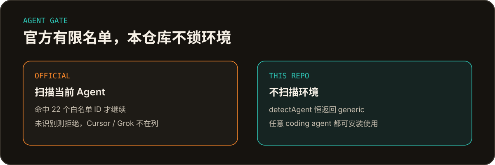

<p align="center">
  
</p>

<p align="center">
  
  &nbsp;
  
</p>

官方夸克网盘 skill **1.0.20** 会扫描当前 Agent 环境，只放行一份固定白名单。名单外的环境（包括 Cursor、Grok）会被拒绝。

本仓库关掉这份环境扫描：`detectAgent()` 恒返回 `generic`，任意 coding agent 都可安装使用。完整约束仍以 [`SKILL.md`](SKILL.md) 为准。

<p align="center">
  
</p>

<p align="center">
  
</p>

官方 CLI 里的 Agent ID（`1.0.20` 源码中的检测表）：

```text
deepseek        workbuddy       workbuddycloud  kimiwork
kimiclaw        hermes          wukong          arkclawcloud
qclaw           claudecode      codex           qwenwork
qoderwork       qodercloud      qoder           minimax
doubao          doubaocloud     easyclaw        maxclawcloud
openclaw        qwencowork
```

共 22 个。没有 Cursor，没有 Grok，也没有「任意 Agent」兜底。未命中就停止。

本仓库不维护另一份白名单，也不猜测你正在用哪个 Agent。安装后一律按 `generic` 运行。

<p align="center">
  
</p>

```bash
bash scripts/install.sh
node scripts/quark-drive.cjs login
```

安装脚本会检测环境、补齐 Node.js >= 16，并下载 CLI。登录走夸克开放平台授权。验证：

```bash
node scripts/quark-drive.cjs --help
```

本 skill 应装到 agent 的**全局 skills 目录**，不要装进单个项目或临时目录。`install.sh` 更新官方包后会重新关掉 Agent 闸门，避免覆盖后再次锁死环境。

<p align="center">
  
</p>

| 能力 | 说明 |
| --- | --- |
| 上传 / 下载 | 支持文件夹递归上传和断点续传 |
| 浏览 / 创建 / 移动 | `browse`、`create-folder`、`move` |
| 搜索 | 按关键词或文件夹检索，结果走 Artifact |
| 转存分享 | 整包、部分文件、更新后增量转存 |
| 批量重命名 | 需用户确认；支持整批撤销 |
| 相册整理 | 仅个人图片和视频，默认复制 |
| AI 助手 | 文件总结与知识问答 |
| 分享 | 生成分享链接 |

```bash
node scripts/quark-drive.cjs <command> [options]
```

<p align="center">
  
</p>

- **这不是官方仓库。** 放宽 Agent 闸门是本仓库的改动。
- **不能把任意资料当相册整理。** `file-organize` 只覆盖个人图片和视频。
- **用户没指定目录时，禁止自行补 `"0"`。**
- 官方 CLI 没有文件删除命令。细节见 [`references/file-ops.md`](references/file-ops.md)。

## 文档

- 总约束与命令入口：[`SKILL.md`](SKILL.md)
- 文件操作：[`references/file-ops.md`](references/file-ops.md)
- 登录与卸载：[`references/auth.md`](references/auth.md)

## 升级

用户说「升级 / 更新夸克网盘 skill」时，执行 `bash scripts/install.sh`。不要用 `node scripts/quark-drive.cjs update`：它只更新 CLI，不更新 `SKILL.md` 和 `references/`。

## 卸载

先 `bash scripts/uninstall.sh`（撤销授权并清除 CLI），再删除 skill 目录。卸载不可逆，执行前必须二次确认。
