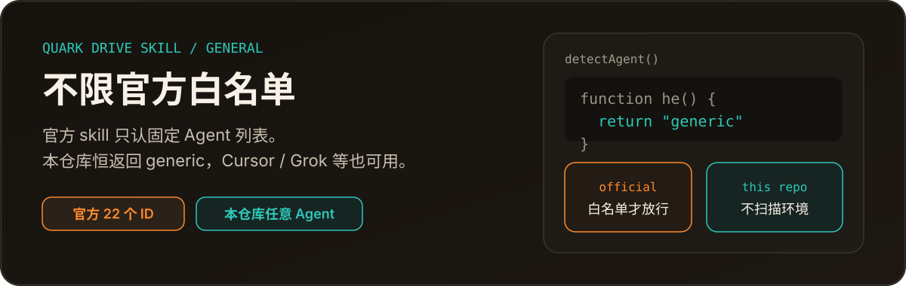
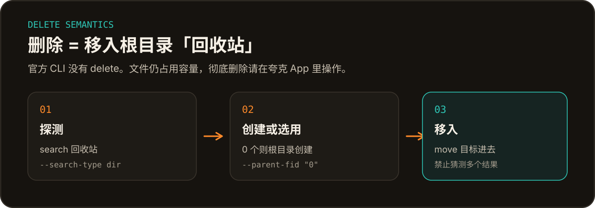

<p align="center">
  
</p>

<p align="center">
  
  &nbsp;
  
</p>

这是官方夸克网盘 skill **1.0.20** 的普适版。Agent 检测恒返回 `generic`，不扫描当前是 Cursor、Grok 还是别的环境。删除语义走网盘根目录「回收站」：官方 CLI 没有 `delete`，本仓库把「删除」写成可执行的 `move` 流程。

完整约束仍以 [`SKILL.md`](SKILL.md) 为准。

<p align="center">
  
</p>

```bash
bash scripts/install.sh
node scripts/quark-drive.cjs login
```

安装脚本会检测环境、补齐 Node.js >= 16，并下载 CLI。登录走夸克开放平台授权。验证：

```bash
node scripts/quark-drive.cjs --help
```

本 skill 应装到 agent 的**全局 skills 目录**，不要装进单个项目或临时目录。

<p align="center">
  
</p>

用户说「删除」时，agent **禁止**编造 `delete` 命令。每次都重新探测，禁止沿用会话里缓存的 FID：

```bash
node scripts/quark-drive.cjs search --keyword "回收站" --search-type dir --stdout-only
```

| 探测结果 | 做法 |
| --- | --- |
| 恰好 1 个名为「回收站」的文件夹 | `move` 进去 |
| 0 个 | `create-folder --dir-path "回收站" --parent-fid "0"`，再 `move` |
| 多个 | 询问用户，禁止猜测 |

这不是官方回收站。文件仍占用容量。移动完成后，告知用户可在夸克 App 中删除「回收站」文件夹。禁止把「回收站」移入自身，也禁止在其中再创建「回收站」。

<p align="center">
  
</p>

| 能力 | 说明 |
| --- | --- |
| 上传 / 下载 | 支持文件夹递归上传和断点续传 |
| 浏览 / 创建 / 移动 | `browse`、`create-folder`、`move` |
| 搜索 | 按关键词或文件夹检索，结果走 Artifact |
| 转存分享 | 整包、部分文件、更新后增量转存 |
| 批量重命名 | 需用户确认；支持整批撤销 |
| 相册整理 | 仅个人图片和视频，默认复制 |
| AI 助手 | 文件总结与知识问答 |
| 分享 | 生成分享链接 |

调用形态：

```bash
node scripts/quark-drive.cjs <command> [options]
```

<p align="center">
  
</p>

- **没有文件删除命令。** 「删除」只能 `move` 进「回收站」，不释放容量。
- **不能把任意资料当相册整理。** `file-organize` 只覆盖个人图片和视频。
- **用户没指定目录时，禁止自行补 `"0"`。** 唯一例外是本仓库约定的根目录「回收站」。
- **这不是官方仓库。** 普适 agent 闸门和回收站语义是本仓库的改动，不要当成夸克官方发布。

## 文档

- 总约束与命令入口：[`SKILL.md`](SKILL.md)
- 文件操作与回收站：[`references/file-ops.md`](references/file-ops.md)
- 登录与卸载：[`references/auth.md`](references/auth.md)

## 升级

用户说「升级 / 更新夸克网盘 skill」时，执行 `bash scripts/install.sh`。不要用 `node scripts/quark-drive.cjs update`：它只更新 CLI，不更新 `SKILL.md` 和 `references/`。

本仓库的 `install.sh` 会在更新后重新放宽 agent 闸门，避免官方包覆盖后重新锁死环境。

## 卸载

先 `bash scripts/uninstall.sh`（撤销授权并清除 CLI），再删除 skill 目录。卸载不可逆，执行前必须二次确认。
